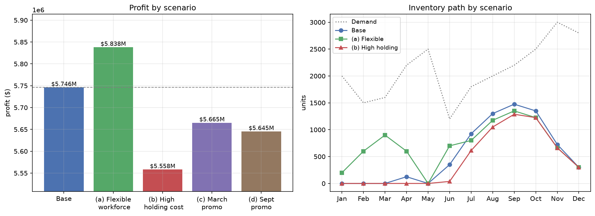

# Production Planning Optimization

Multi-period production planning models built in Python with Gurobi. Two notebooks: a
production and storage model with a perishable inventory limit, and an aggregate planning
model covering workforce, overtime, backlogs and four alternative business scenarios.

Each notebook is self-contained. Data is defined inline, and every result is reproduced by
running the notebook top to bottom. Outputs are committed, so the models can be read
without installing a solver.

---

## Notebooks

### 1. [Production Planning with Perishable Inventory](01_production_planning_perishable_inventory.ipynb)

Twelve months of known demand, 800 units of regular capacity and 200 of overtime each
month, and a product that can be held for at most two months after it is made. The model
decides how much to produce in each month and mode, and which month each unit is sold in.

**Model:** linear program, with production month, mode and sale month as variable indices

| | Value |
| --- | ---: |
| Minimum total cost | $102,100 |
| Regular-time units | 9,400 |
| Overtime units | 600 |
| Unit-months of storage | 900 |

- **Storage is what makes the problem solvable, not just cheaper.** March, June and
  December each demand 1,100 units against a maximum monthly capacity of 1,000, so those
  months must be partly pre-built. With no carry-over allowed the problem is infeasible.
- **The `$1` holding cost undercuts the `$2` overtime premium**, so the plan banks cheap
  regular-time output wherever an earlier month has spare capacity. Overtime is used in
  only three months, and just 6% of output is made that way.
- **No unit is ever held more than one month**, even though two are allowed, so the
  perishability limit does not bind at these demand levels.
- Building variables only for valid combinations gives 66 variables instead of the 288 a
  full grid would need, with no forced-to-zero variables in the model.

---

### 2. [Aggregate Production Planning](02_aggregate_production_planning.ipynb)

Four television models collapsed into a single sales-mix-weighted aggregate unit, then
planned across 12 months with a fixed 25-worker crew, optional overtime, inventory and
backlogging. The base plan is solved, then re-solved under four independent scenarios.

**Model:** mixed-integer linear program, with workforce balance, production capacity, and a
combined inventory and backlog balance

| Scenario | Total cost | Profit | vs base |
| --- | ---: | ---: | ---: |
| Base plan | $9,307,300 | $5,746,200 | — |
| (a) Hiring and layoffs allowed | $9,215,325 | $5,838,175 | +$91,975 |
| (b) Holding cost raised to $40 | $9,495,250 | $5,558,250 | −$187,950 |
| (c) March promotion | $9,435,380 | $5,665,320 | −$80,880 |
| (d) September promotion | $9,470,750 | $5,645,400 | −$100,800 |



- **The base plan is a level strategy by necessity.** With the workforce frozen and
  capacity capped at 2,375 units a month, inventory is the only way to move production into
  the November and December peak. The plan uses no overtime and no backlogs at all.
- **Workforce flexibility is worth about `$92,000`.** Allowing hiring and layoffs switches
  the plan from level to chase, with 5 workers out in January and 5 back in August.
- **Cheap storage is what the base plan runs on.** At a `$40` holding cost the plan holds
  less stock, uses overtime, and accepts a deliberate 125-unit backlog in May, where the
  late-delivery penalty beats the cost of storing.
- **Neither promotion is worth running.** Both raise revenue and both lower profit.
  September is worse, because it sits against months that are already capacity-tight and
  applies the discount to a larger volume.

---

## Requirements

| Library | Used for | Notebooks |
| --- | --- | --- |
| `pandas` | data tables and solution reporting | 1, 2 |
| `numpy` | numerical arrays | 2 |
| `matplotlib` | scenario comparison charts | 2 |
| `gurobipy` | linear and mixed-integer programming | 1, 2 |
| `jupyterlab` | running the notebooks | 1, 2 |

```bash
pip install pandas numpy matplotlib gurobipy jupyterlab
```

### Solver

Both notebooks use Gurobi. The `pip install gurobipy` package ships with a size-limited
licence covering models up to 2,000 variables and 2,000 constraints, which is well beyond
what these instances need, so no separate licence is required to reproduce the results.

Both models translate directly to `pulp` with CBC or to `python-mip` if you prefer an
open-source solver. The formulations in the markdown cells are solver-agnostic.

---

## Running the notebooks

```bash
git clone https://github.com/JayeshYevale/production-planning-optimization.git
cd production-planning-optimization
pip install -r requirements.txt
jupyter lab
```

All data is defined inline in the notebooks. These instances are small enough that keeping
the data beside the model is clearer than loading it from separate files.

---

## Repository layout

```
production-planning-optimization/
├── 01_production_planning_perishable_inventory.ipynb
├── 02_aggregate_production_planning.ipynb
├── figures/
│   └── scenario_comparison.png
├── requirements.txt
├── LICENSE
└── README.md
```

## Licence

MIT, see [LICENSE](LICENSE).
